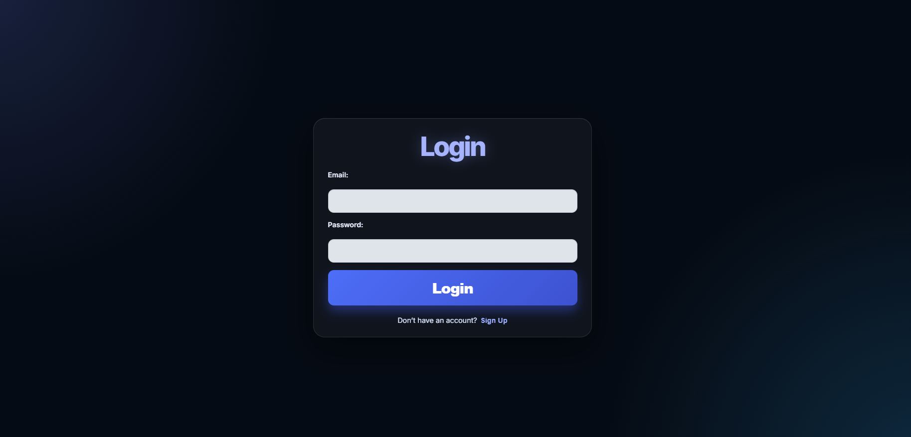
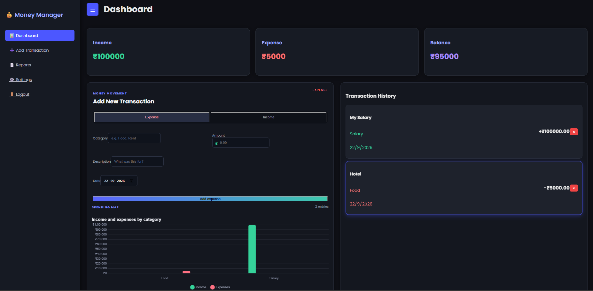
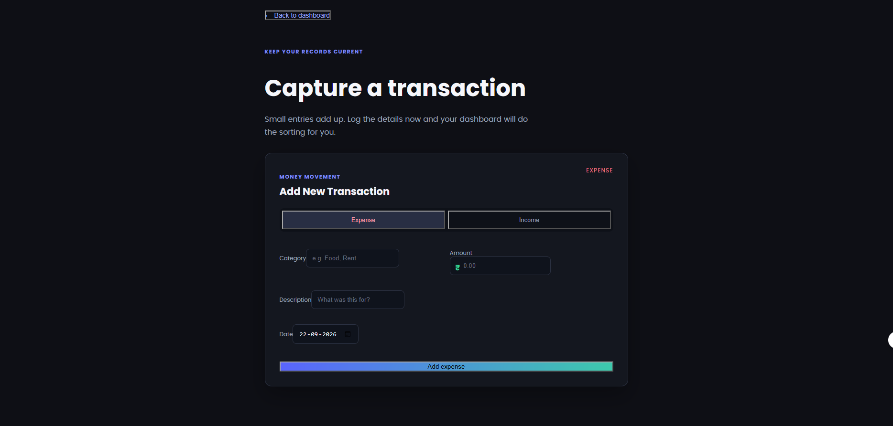
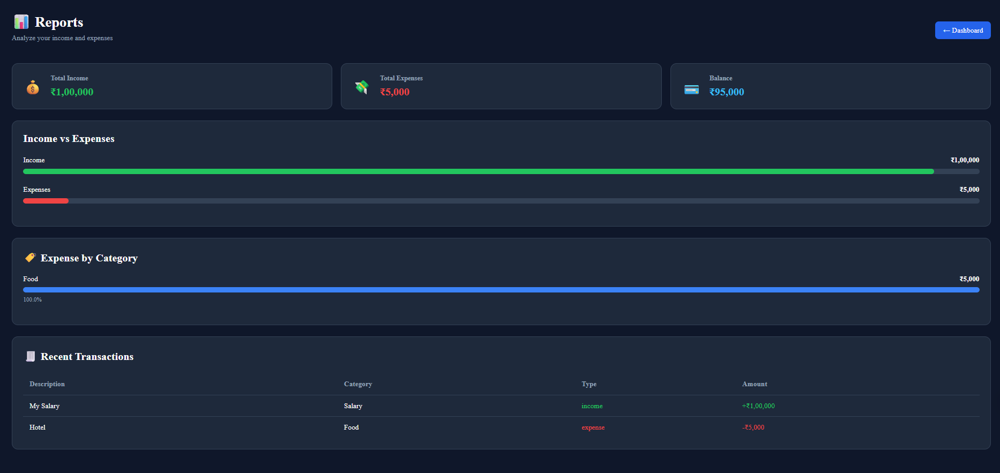

# 💰 Expense Tracker

A full-stack **MERN Expense Tracker** that allows users to securely manage income and expenses, view financial summaries, and store transaction data in MongoDB.

## 🌐 Live Demo

🚀 **[Open Expense Tracker](https://expense-tracker-frontend-kxmy.onrender.com)**

The application is deployed and available online.

## 📂 GitHub Repository

**[View Source Code](https://github.com/unaizy/Expense_Tracker)**

## ✨ Features

* 🔐 User registration and login
* 🔑 JWT-based authentication
* 💰 Add income and expense transactions
* 🗑️ Delete transactions
* 📋 View transaction history
* 📊 Income, expense, and balance summaries
* 📈 Financial summary chart
* 💾 Persistent data storage with MongoDB
* 👤 User-specific transaction data
* 🔄 Transactions remain available after logout and login
* 📱 Responsive dashboard interface

## 🛠️ Technologies Used

### Frontend

* React.js
* React Router
* Axios
* Chart.js
* CSS

### Backend

* Node.js
* Express.js
* MongoDB
* Mongoose
* JSON Web Tokens (JWT)
* bcryptjs

### Deployment

* Render
* MongoDB Atlas
* GitHub

## 🏗️ Project Structure

```text
Expense_Tracker/
│
├── backend/
│   ├── controllers/
│   ├── middleware/
│   ├── models/
│   ├── routes/
│   ├── server.js
│   └── package.json
│
├── frontend/
│   ├── public/
│   ├── src/
│   └── package.json
│
├── screenshots/
│   ├── login.png
│   ├── dashboard.png
│   ├── add-transaction.png
│   └── reports.png
│
└── README.md
```

> `.env` files and `node_modules` are excluded from the repository using `.gitignore`.

## 🔐 Authentication

The application uses **JWT authentication** to protect user-specific transaction data.

Users can:

1. Create an account
2. Log in securely
3. Add transactions
4. View their transaction history
5. Delete transactions
6. Log out and log back in while retaining their saved data

## 💾 Database

The application uses **MongoDB Atlas** to store user accounts and transactions.

Each transaction is associated with its respective authenticated user, ensuring that users access their own transaction data.

## 📸 Screenshots

### 🔐 Login



### 📊 Dashboard



### ➕ Add Transaction



### 📄 Reports



## 🚀 Running the Project Locally

### 1. Clone the repository

```bash
git clone https://github.com/unaizy/Expense_Tracker.git
```

### 2. Open the project

```bash
cd Expense_Tracker
```

### 3. Start the backend

```bash
cd backend
npm install
npm start
```

The backend will run at:

```text
http://localhost:5000
```

### 4. Start the frontend

Open another terminal:

```bash
cd frontend
npm install
npm start
```

The React application will normally run at:

```text
http://localhost:3000
```

## 🔑 Environment Variables

Create a `.env` file inside the `backend` folder:

```env
PORT=5000
MONGODB_URI=your_mongodb_connection_string
JWT_SECRET=your_jwt_secret
```

**Never upload your actual `.env` file or database credentials to GitHub.**

## 👨‍💻 Author

### Unaiz Y

Computer Science Engineering Student

**GitHub:**
https://github.com/unaizy

---

⭐ If you find this project useful, consider giving the repository a star!
